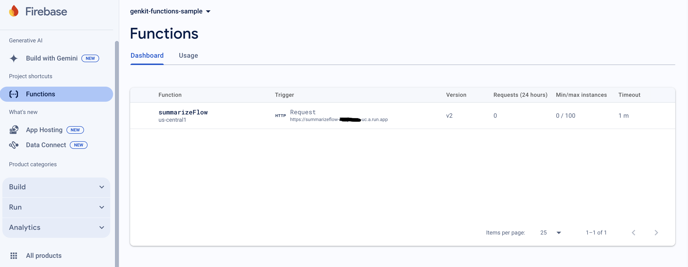
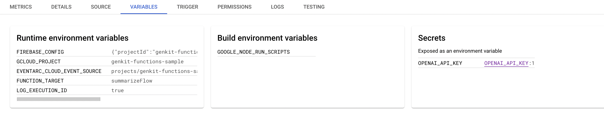

# Deploying Your Firebase Genkit Application with Firebase Functions

This post will guide you through deploying your Firebase Genkit application to Firebase Functions step by step.

Start by cloning the example repository to get a hands-on experience:

```bash
$ git clone https://github.com/yukinagae/genkit-firebase-functions-sample.git
```

For those new to Firebase Genkit, I recommend starting with my introductory blog post: [Your First Guide to Getting Started with Firebase Genkit](https://medium.com/@yukinagae/your-first-guide-to-getting-started-with-firebase-genkit-6948d88e8a92). It lays the groundwork for understanding the core concepts of Firebase Genkit.

## Preparing for Deployment

Before deploying your application, complete the following preparatory steps:

1. **Create a Firebase project**:

Navigate to the Firebase Console. Click on `Create a project` and follow the prompts to create a new Firebase project.

2. **Switch to the Blaze plan**:

Firebase Functions require the `Blaze (Pay as you go) plan` for deployment. In the Firebase Console, select your project, then navigate to the left side bar section to change your plan.

3. **Configure your Firebase project locally**:

Update the `.firebaserc` file in your project's root directory to include your Firebase project name:

```json
{
  "projects": {
    "default": "your_project_name"
  }
}
```

## Local Emulator

To facilitate local development and testing of Firebase Functions, use the Firebase Emulator Suite. Follow these steps to run your functions locally:

To run Firebase Functions locally using the emulator, set your OpenAI API key as an environment variable and start the emulator:

```bash
$ export OPENAI_API_KEY=your_api_key

$ npm run emulator
# or
$ GENKIT_ENV=dev firebase emulators:start --inspect-functions
```

To test the function on the emulator, use the following curl command with a valid token (token1234 in this project):

```bash
$ curl -X POST -H "Content-Type: application/json" \
-H "Authorization: Bearer token1234" \
-d '{"data":{"url":"https://firebase.blog/posts/2024/04/next-announcements/","lang":"English"}}' \
http://127.0.0.1:5001/[your_project_name]/us-central1/summarizeFlow
{"result":"Firebase announced new features at Cloud Next '24, including Firestore vector search, Vertex AI SDKs, and public preview of Gemini integration."}
```

With an invalid token:

```bash
$  curl -X POST -H "Content-Type: application/json" \
-H "Authorization: Bearer invalid_token" \
-d '{"data":{"url":"https://firebase.blog/posts/2024/04/next-announcements/","lang":"English"}}' \
http://127.0.0.1:5001/[your_project_name]/us-central1/summarizeFlow
Unauthorized
```

Token verification is implemented through the `authPolicy` within the `onFlow` method:

```typescript
authPolicy: {
  async policy() {},
  // restrict access using Bearer token
  async provider(req, res, next) {
    const token = req.headers.authorization?.split(/[Bb]earer /)[1];
    // dummy token
    if (token && token === "token1234") {
      next();
    } else {
      throw new Error("Unauthorized");
    }
  },
},
```

While this implementation may not be ready for production, it is sufficiently enough for application testing purposes.

For scenarios where authorization is not necessary, use `noAuth()` as follows:

```typescript
import { noAuth } from "@genkit-ai/firebase/functions";

authPolicy: noAuth(),
```

## Deploy

To authenticate with Firebase and access your projects, use the Firebase CLI login command:

```bash
$ firebase login
```

To keep your OpenAI API key safe when using Firebase Functions, store it as a secret in Google Cloud Secret Manger:

```bash
$ firebase functions:secrets:set OPENAI_API_KEY
? Enter a value for OPENAI_API_KEY [input is hidden]
```

To confirm your OpenAI API key is correctly stored as a secret, use the following command:

```bash
$ firebase functions:secrets:access OPENAI_API_KEY
your_api_key
```

After securing your API key, you're ready to deploy your application to Firebase Functions:

```bash
$ npm run deploy
```



In the Cloud Functions dashboard, you'll notice that a secret value `OPENAI_API_KEY` is specified within the `VARIABLES` section.

NOTE: Secret values within Cloud Functions are applied after deployment, not before deployment.



To test your deployed function, execute the `curl` command below:

```bash
$  curl -X POST -H "Content-Type: application/json" \
-H "Authorization: Bearer token1234" \
-d '{"data":{"url":"https://firebase.blog/posts/2024/04/next-announcements/","lang":"English"}}' \
https://summarizeflow-[your_function_id]-uc.a.run.app
{"result":"Firebase announced new features at Cloud Next '24, including Firestore vector search, Vertex AI SDKs, and public preview of Gemini integration."}
```

Replace `[your_function_id]` with your Firebase project value, found in the Firebase Console under the Functions Dashboard.

---

For developers eager to explore the integration of Firebase Genkit with Firebase Functions, I highly recommend diving into my example project:

https://github.com/yukinagae/genkit-firebase-functions-sample

This project serves as a practical guide, offering hands-on experience with the combination of Firebase Genkit and Firebase Functions.
